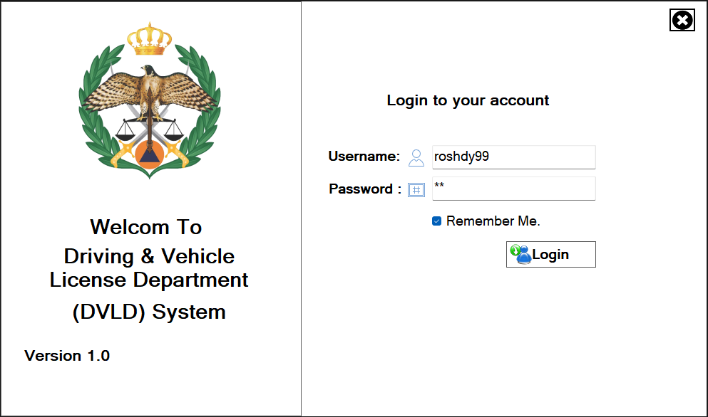
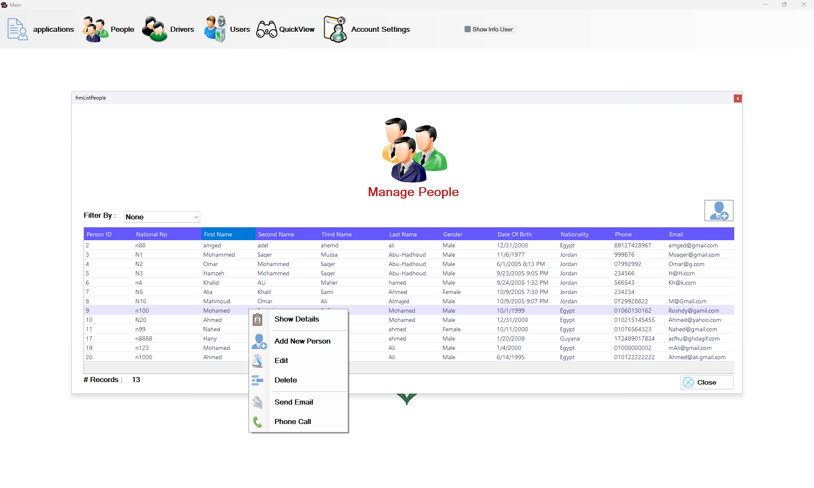
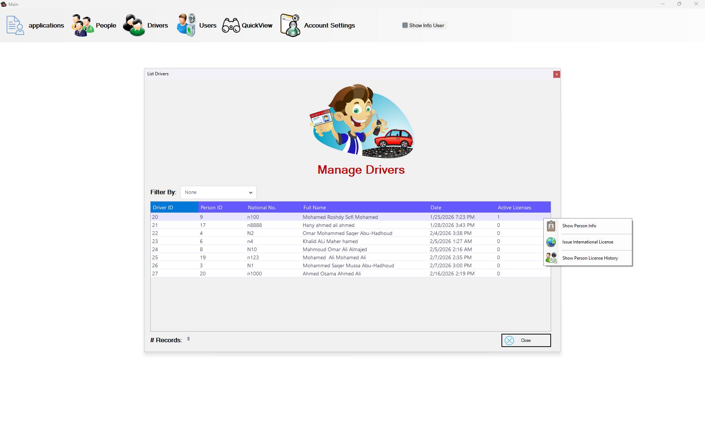
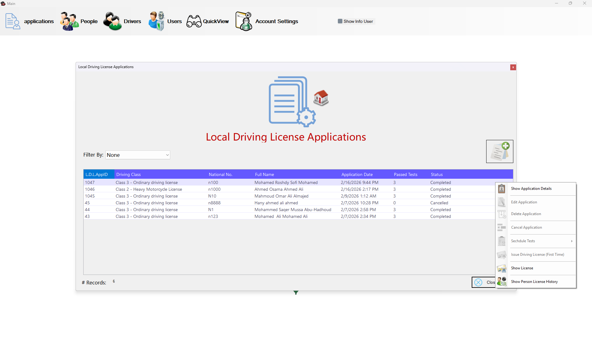
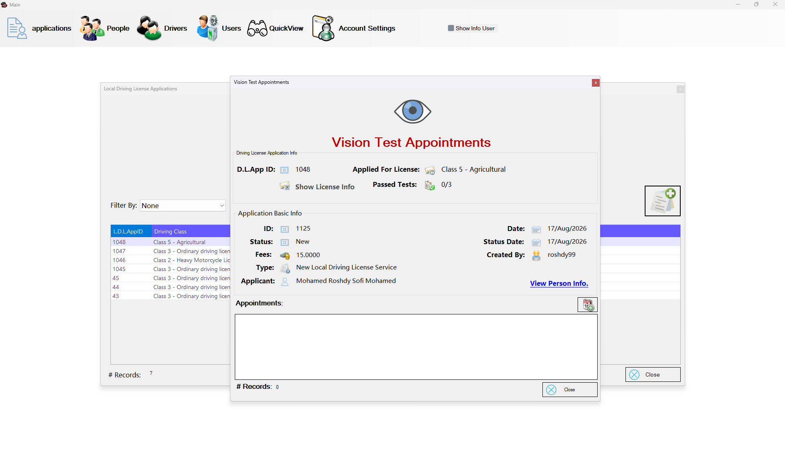
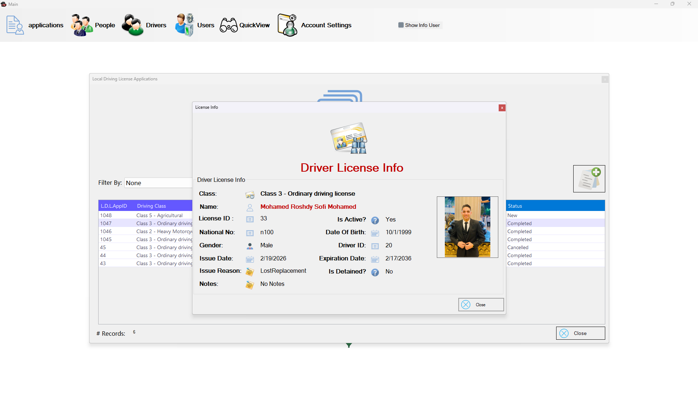
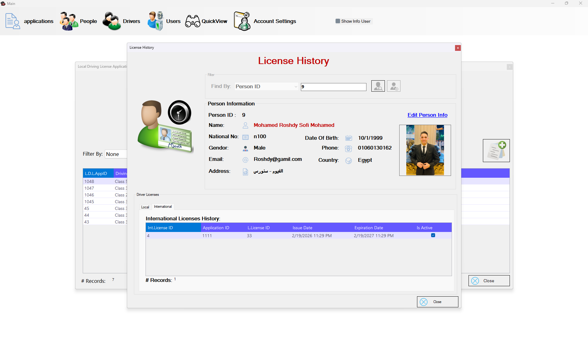
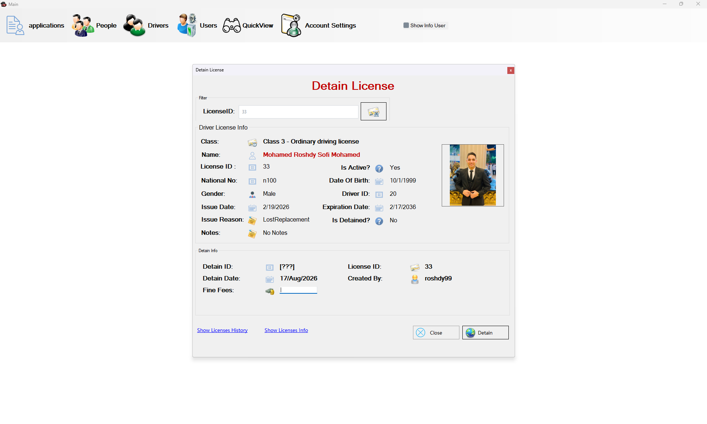

# 🚗 DVLD — Driving & Vehicle License Department Management System

<p align="center">
  <strong>A desktop-based Driving & Vehicle License Department Management System</strong>
  <br/>
  Built with C#, Windows Forms, SQL Server, and a layered architecture.
</p>

<p align="center">
  <a href="https://github.com/MohamedRoshdy404/DVLD">
    
  </a>
  
  
  
  
</p>

---

## 📌 Overview

**DVLD** is a desktop application designed to simulate and manage the core operations of a **Driving & Vehicle License Department**.

The system provides an integrated environment for managing people, users, drivers, driving license applications, tests, local and international licenses, detained licenses, and other related workflows.

The project was built with a strong focus on:

* Clean separation of responsibilities
* Layered application architecture
* Reusable business logic
* Database-driven operations
* Role-based access control
* Maintainable and scalable code structure
* Real-world business workflows

---

## 🎯 Project Goals

The main goal of this project is to build a complete desktop management system that demonstrates how a real-world business application can be structured using **C# and SQL Server**.

The project focuses not only on implementing CRUD operations, but also on modeling relationships between different business entities and handling complete workflows such as:

> Person → Application → Tests → License → License History

---

# ✨ Features

## 👥 People Management

Manage the people registered within the system.

* Add new people
* Update existing people
* Delete people
* Search and filter people
* View detailed person information
* Store personal information and profile images
* Reusable person information controls

---

## 👤 User Management

Manage system users and their access.

* User authentication
* Add new users
* Update users
* Delete users
* View user information
* Change password
* Sign out
* Permission-based menu visibility

The application dynamically controls access to different modules based on the current user's permissions.

---

## 🚘 Driver Management

Manage drivers registered in the system.

* View drivers
* Search drivers
* Display driver information
* View driver's license history
* Connect drivers with their related applications and licenses

---

# 📝 Applications Management

The system supports multiple types of license-related applications.

### Local Driving License Applications

* Create new applications
* View existing applications
* Manage application status
* Schedule required tests
* Retake failed tests
* Complete the licensing workflow

### International License Applications

* Create international license applications
* View international applications
* Manage international license information
* Connect international licenses with existing driver records

### Other Applications

The system also supports workflows for:

* License renewal
* Lost license replacement
* Damaged license replacement
* Detained license release

---

# 🧪 Tests Management

The application manages the testing process required for driving licenses.

Supported test types include:

* 👁️ Vision Test
* 📝 Written Test
* 🚗 Practical Driving Test

The system allows:

* Scheduling test appointments
* Taking tests
* Recording test results
* Retaking failed tests
* Managing test types

---

# 🪪 License Management

Manage different types of driving licenses.

### Local Licenses

* Issue a license for the first time
* Display license information
* View license history
* Detain licenses
* Release detained licenses

### International Licenses

* Issue international licenses
* View international license information
* Manage international license applications

---

# 🔐 Authentication & Authorization

The application includes an authentication and authorization mechanism.

### Authentication

Users must log in before accessing the system.

The currently authenticated user is maintained throughout the application session.

### Authorization

The system uses permissions to control access to different application modules.

For example, users may have permissions related to:

* User management
* Application management
* License detention
* Application types
* Test types

Unauthorized modules are hidden from the user interface.

---

# 🏗️ Architecture

The project follows a **Layered Architecture** to separate responsibilities between the presentation layer, business logic, and data access.

```text
┌─────────────────────────────────────────────┐
│              Presentation Layer             │
│                                             │
│              ProjectDVLD                    │
│          Windows Forms / UI                 │
└──────────────────────┬──────────────────────┘
                       │
                       ▼
┌─────────────────────────────────────────────┐
│               Business Layer                │
│                                             │
│              DVLD_Buisness                  │
│          Business Rules & Logic             │
└──────────────────────┬──────────────────────┘
                       │
                       ▼
┌─────────────────────────────────────────────┐
│               Data Access Layer             │
│                                             │
│             DVLD_DataAccess                 │
│          Database Operations                │
└──────────────────────┬──────────────────────┘
                       │
                       ▼
┌─────────────────────────────────────────────┐
│                 SQL Server                  │
│                  Database                  │
└─────────────────────────────────────────────┘
```

### Layer Responsibilities

| Layer             | Responsibility                                  |
| ----------------- | ----------------------------------------------- |
| `ProjectDVLD`     | Forms, controls, user interaction, presentation |
| `DVLD_Buisness`   | Business rules and application logic            |
| `DVLD_DataAccess` | Database communication and data operations      |
| `DBFile`          | Database backup                                 |

This separation makes the system easier to understand, test, maintain, and extend.

---

# 📂 Project Structure

```text
DVLD/
│
├── DBFile/
│   └── DVLD.bak
│
├── DVLD_DataAccess/
│   ├── clsPersonDataAccess.cs
│   ├── clsDriverDA.cs
│   ├── clsLicenseDA.cs
│   ├── clsApplicationsDataAccess.cs
│   ├── clsTestDA.cs
│   └── ...
│
├── DVLD_Buisness/
│   ├── clsPersonBuisnessLayer.cs
│   ├── clsDriverBL.cs
│   ├── clsLicenseBL.cs
│   ├── clsApplicationsBuisnessLayer.cs
│   ├── clsTestBL.cs
│   └── ...
│
├── ProjectDVLD/
│   │
│   ├── Applications/
│   ├── Drivers/
│   ├── Global Classes/
│   ├── Licenses/
│   ├── Login/
│   ├── People/
│   ├── QuickView/
│   ├── Tests/
│   ├── Users/
│   │
│   ├── Main.cs
│   ├── Program.cs
│   └── App.config
│
└── ProjectDVLD.sln
```

---

# 🛠️ Technologies & Tools

### Backend / Application

* **C#**
* **.NET Framework 4.7.2**
* **Windows Forms**

### Database

* **Microsoft SQL Server**
* **ADO.NET**
* Relational database design
* Stored database backup

### Architecture & Design

* Layered Architecture
* Separation of Concerns
* Object-Oriented Programming
* Encapsulation
* Reusable User Controls
* Business Logic Layer
* Data Access Layer

### Development Tools

* Visual Studio
* Git
* GitHub
* SQL Server Management Studio

---

# 🔄 Core Business Workflow

One of the main workflows of the system can be represented as:

```text
Person
   │
   ▼
Create Driving License Application
   │
   ▼
Schedule Tests
   │
   ├──► Vision Test
   │
   ├──► Written Test
   │
   └──► Driving Test
             │
             ▼
       Test Results
             │
             ▼
     License Issuance
             │
             ▼
       Driver Record
             │
             ▼
      License History
```

This workflow demonstrates how multiple business entities interact with each other instead of treating every feature as an isolated CRUD operation.

---

# 🧩 Reusable Components

The application contains reusable Windows Forms controls to reduce duplicated UI logic.

Examples include components for:

* Person information
* Driver information
* License information
* Application information
* Test information
* User information

These controls can be embedded into different forms where the same information needs to be displayed.

---

# 🔒 Permission-Based UI

The system does not simply authenticate users; it also applies authorization rules to the application's interface.

For example:

```csharp
if (!clsUtil.CheckPermissions(...))
{
    someMenuItem.Visible = false;
}
```

This allows the application to dynamically control which operations are available to the currently logged-in user.

---

# 🗄️ Database

A SQL Server database is used as the persistence layer.

The repository includes a database backup:

```text
DBFile/
└── DVLD.bak
```

The database stores information related to:

* People
* Users
* Drivers
* Applications
* Application Types
* License Classes
* Tests
* Test Appointments
* Local Licenses
* International Licenses
* Detained Licenses
* Countries

---

# 🚀 Getting Started

## Prerequisites

Before running the project, make sure you have:

* Windows
* Visual Studio
* .NET Framework 4.7.2
* SQL Server
* SQL Server Management Studio

---

## 1. Clone the Repository

```bash
git clone https://github.com/MohamedRoshdy404/DVLD.git
```

```bash
cd DVLD
```

---

## 2. Restore the Database

The repository contains the database backup:

```text
DBFile/DVLD.bak
```

Restore the backup using **SQL Server Management Studio**.

After restoring the database, verify that the database is available from your SQL Server instance.

---

## 3. Configure the Connection String

Open:

```text
ProjectDVLD/App.config
```

Update the SQL Server connection string according to your local environment.

Example:

```xml
<connectionStrings>
    <add
        name="DVLD"
        connectionString="Server=YOUR_SERVER;Database=DVLD;Integrated Security=True;"
        providerName="System.Data.SqlClient" />
</connectionStrings>
```

> Replace `YOUR_SERVER` with your SQL Server instance name.

---

## 4. Open the Solution

Open:

```text
ProjectDVLD.sln
```

using Visual Studio.

---

## 5. Build & Run

Build the solution:

```text
Build → Build Solution
```

Then run the application:

```text
Debug → Start Debugging
```

---

# 🖥️ Application Modules

The main application dashboard provides access to multiple modules:

```text
┌───────────────────────────────────────┐
│              DVLD System              │
├───────────────────────────────────────┤
│                                       │
│  👥 People                            │
│  👤 Users                             │
│  🚘 Drivers                           │
│                                       │
│  📝 Applications                      │
│  🧪 Tests                             │
│  🪪 Licenses                          │
│                                       │
│  🌍 International Licenses            │
│  🔒 Detained Licenses                 │
│                                       │
└───────────────────────────────────────┘
```

---

# 📸 Application Preview

A visual overview of the DVLD system, showcasing some of its main screens and core management workflows.

<div align="center">

### 🔐 Authentication



---

### 🏠 Main Dashboard


---

### 👥 People & Drivers Management




<br/><br/>

---

### 📝 Applications & Tests




<br/><br/>

---

### 🪪 License Management




<br/><br/>

---

### 🔒 Detained Licenses



</div>

> 📌 **Note:** The screenshots above represent selected screens from the application and are intended to provide a quick visual overview of the system's user interface and main workflows.


---

# 🧠 What I Learned From This Project

Building DVLD provided practical experience with several important software engineering concepts:

* Designing multi-layer desktop applications
* Applying Object-Oriented Programming
* Separating UI, business logic, and data access
* Working with relational databases
* Designing database-driven workflows
* Implementing authentication
* Implementing authorization and permissions
* Managing complex entity relationships
* Creating reusable Windows Forms controls
* Working with ADO.NET and SQL Server
* Handling real-world business rules
* Structuring a maintainable C# application

---

# 🔮 Future Improvements

Possible future improvements include:

* [ ] Migrate the application to modern .NET
* [ ] Improve dependency management
* [ ] Introduce Dependency Injection
* [ ] Add automated unit tests
* [ ] Improve centralized exception handling
* [ ] Add structured logging
* [ ] Improve application configuration management
* [ ] Introduce a modern UI design system
* [ ] Add reporting and analytics
* [ ] Add database migration/versioning support
* [ ] Improve security around authentication and credentials

---

# 📚 Project Purpose

This project was developed as a practical software engineering project to apply concepts related to:

**C# → OOP → SQL Server → ADO.NET → Layered Architecture → Business Logic → Desktop Application Development**

The main objective is to demonstrate the ability to transform a complex business domain into a structured, maintainable software system.

---

# 👨‍💻 Author

**Mohamed Roshdy**

.NET Backend Developer

Focused on:

```text
C#
.NET
SQL Server
ADO.NET
OOP
Software Architecture
Backend Development
```

---

# ⭐ Support

If you find this project useful or interesting, consider giving the repository a ⭐ on GitHub.

<p align="center">
  <strong>Built with C# ❤️ and a lot of debugging.</strong>
</p>
